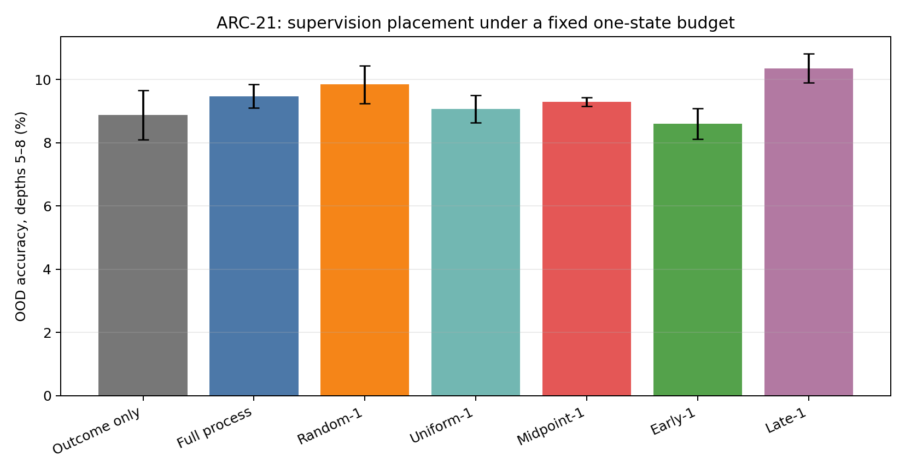
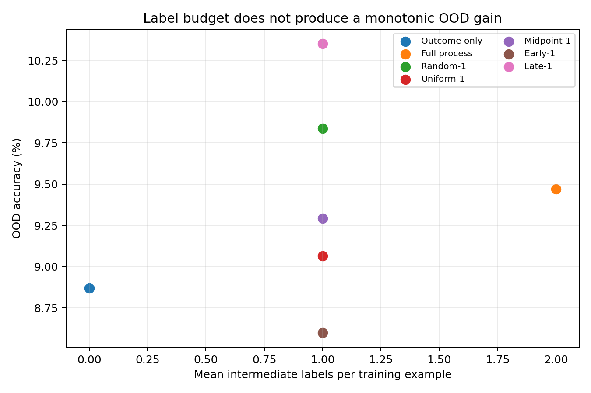
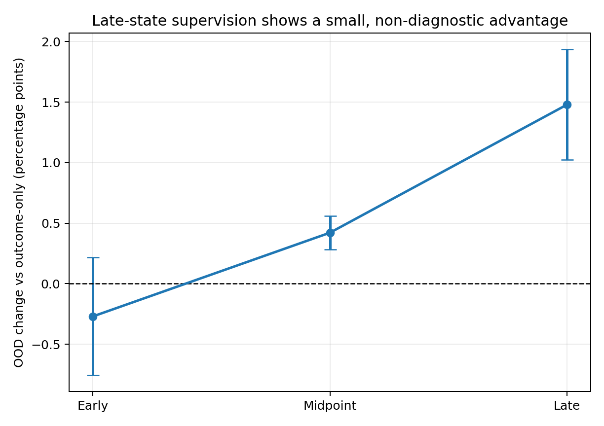
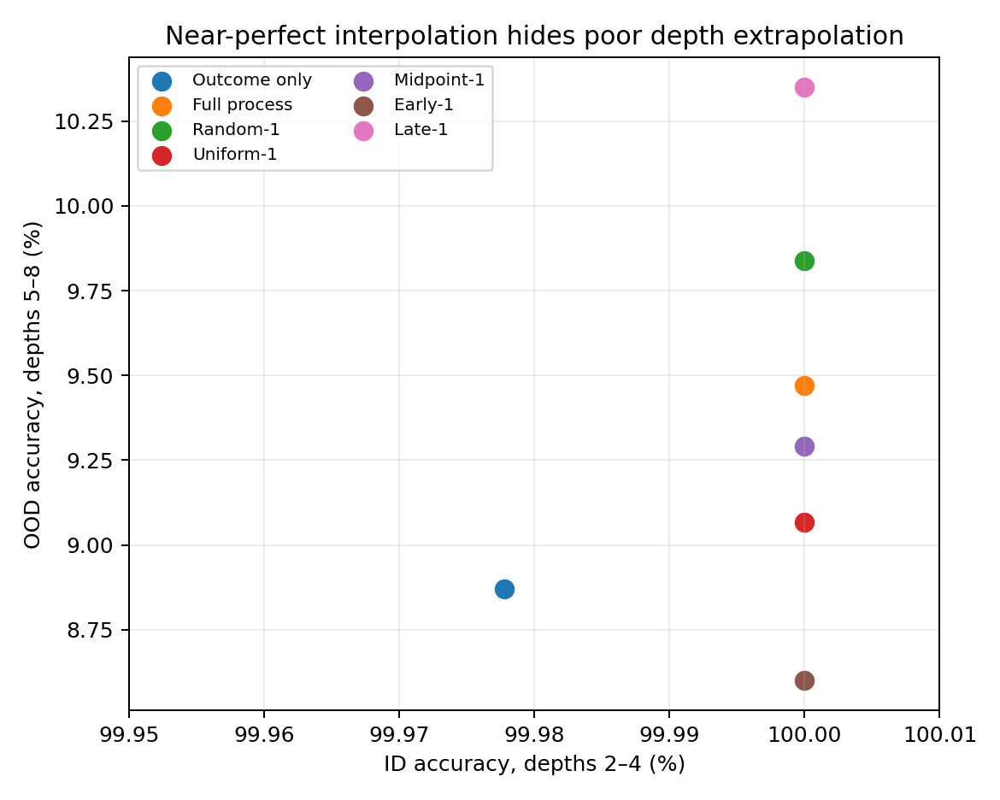

# ARC-21 final screening report

## Required verdict

**Novelty: YELLOW**

**MVP result:** The controlled chain experiment does not support the proposed
critical-step/bottleneck selection hypothesis. A small late-position effect is
present, but it is not diagnostic of criticality and is mainly confined to the
first unseen depth.

**Does supervision placement matter? YES** — narrowly: Late-1 exceeded Early-1
in all three seeds, but the result is small, underpowered, and position-confounded.

**Does critical-step selection beat random? NO** — Midpoint-1 was below Random-1
in every seed (mean difference -0.55 percentage points).

**Does effect survive budget matching? YES** — the late-versus-early positional
difference uses exactly one intermediate-state label in both conditions. The
critical-versus-random claim does not survive because its measured effect is
negative.

**Does effect survive >=3 seeds? YES** — only for the direction of Late-1 versus
Early-1; this is not a confirmed critical-step effect (paired p=0.074, n=3).

**Does effect improve OOD generalization? YES** — Late-1 improves mean depth-5–8
accuracy over Outcome Only by 1.48 percentage points, but most of the separation
comes from depth 5 and does not establish robust length extrapolation.

**Strongest positive evidence:** Late-1 outperformed Early-1 in all three seeds,
with a paired mean difference of +1.75 percentage points. Late-1 was the highest
mean strategy at 10.35% OOD accuracy.

**Strongest negative evidence:** Midpoint-1 lost to Random-1 in every seed; its
mean OOD accuracy was 9.29% versus 9.84%. Late-1 exceeded Random-1 by only 0.51
points on average and lost in one seed. At depths 6–8 all methods were near the
3.125% chance level, so the apparent signal does not yield sustained depth
extrapolation.

## Novelty gate

The broad framing is already crowded. [GPO: Learning from Critical Steps](https://arxiv.org/abs/2509.16456)
and [Verified Critical Step Optimization](https://arxiv.org/abs/2602.03412)
directly study critical-step optimization. The surviving narrow question was
the controlled comparison of exact intermediate-state placement under a matched
state-label budget and OOD composition depth. That narrow protocol was worth a
cheap test, but a positive paper-level claim did not survive it. The complete
collision audit is in [`novelty_matrix.md`](../literature/novelty_matrix.md).

## Experimental design

- Task: exact compositional function execution over 32 states using eight
  bijective modular/bitwise functions.
- Train depths: 2, 3, 4. Test depths: 2 through 8; depths 5–8 are OOD.
- Model: 1,332,640-parameter, 8-layer causal Transformer (width 128, 4 heads).
- Data: 60,000 freshly generated training examples per epoch, 20 epochs; fixed
  2,000-example evaluation set per depth.
- Seeds: 11, 23, 37.
- Conditions: Outcome Only, Full Process, Random-1, Uniform-1, Midpoint-1,
  Early-1, Late-1.
- Controls: identical architecture, initialization within seed, underlying
  training examples, optimizer, steps, input length, and final-answer loss.
  Every `*-1` condition receives exactly one intermediate label per example.
  Full Process uses a mean (not sum) auxiliary loss.
- No paid APIs, pretrained models, fabricated data, or textual-CoT length
  differences were used.

## Main results

OOD is the unweighted mean accuracy over depths 5–8. Values are mean ± sample SD
over three seeds.

| Strategy | Intermediate labels/example | ID accuracy (%) | OOD accuracy (%) | Seed OOD accuracies (%) |
|---|---:|---:|---:|---|
| Outcome Only | 0 | 99.98 ± 0.02 | 8.87 ± 0.78 | 9.06, 8.01, 9.54 |
| Full Process | 2 on average | 100.00 ± 0.00 | 9.47 ± 0.38 | 9.66, 9.04, 9.71 |
| Random-1 | 1 | 100.00 ± 0.00 | 9.84 ± 0.60 | 9.84, 9.24, 10.44 |
| Uniform-1 | 1 | 100.00 ± 0.00 | 9.07 ± 0.44 | 9.51, 8.64, 9.05 |
| Midpoint-1 | 1 | 100.00 ± 0.00 | 9.29 ± 0.14 | 9.23, 9.20, 9.45 |
| Early-1 | 1 | 100.00 ± 0.00 | 8.60 ± 0.49 | 8.05, 8.78, 8.98 |
| Late-1 | 1 | 100.00 ± 0.00 | 10.35 ± 0.46 | 10.80, 9.89, 10.36 |

Key paired comparisons (percentage points):

| Comparison | Per-seed differences | Mean ± SD | Two-sided paired t-test |
|---|---|---:|---:|
| Midpoint-1 − Random-1 | -0.61, -0.04, -0.99 | -0.55 ± 0.48 | p=0.187 |
| Midpoint-1 − Uniform-1 | -0.29, +0.56, +0.40 | +0.23 ± 0.45 | p=0.479 |
| Late-1 − Early-1 | +2.75, +1.11, +1.39 | +1.75 ± 0.88 | p=0.074 |
| Late-1 − Random-1 | +0.96, +0.65, -0.08 | +0.51 ± 0.53 | p=0.237 |
| Full Process − Outcome Only | +0.60, +1.02, +0.17 | +0.60 ± 0.42 | p=0.134 |

These tests are descriptive: n=3 is too small for a strong inferential claim,
and no multiplicity correction would improve the evidential status.

## Depth diagnosis

The late-versus-early advantage is not uniform: +6.48 points at depth 5,
-0.97 at depth 6, +1.07 at depth 7, and +0.42 at depth 8. For Late-1 versus
Random-1 the corresponding differences are +2.33, -0.50, +0.02, and +0.20.
This pattern is consistent with a modest first-extrapolation benefit, not a
general solution to longer composition.

## Figures

## Why this ARC stops

1. The intended critical proxy, Midpoint-1, is worse than Random-1 in all seeds.
2. The only consistent ordering is Late-1 over Early-1, directly triggering the
   predeclared “later/easier state” confound rather than supporting bottlenecks.
3. Late-1 does not consistently beat Random-1 and its advantage is concentrated
   at depth 5.
4. Near-perfect ID accuracy for every condition does not translate to meaningful
   depth-6–8 extrapolation.
5. The broad critical-step narrative has high collision risk, raising the bar for
   a narrow behavioral result.
6. A DAG task or representation analysis would be unjustified after the MVP
   failed the central comparison.

## Reproducibility and resources

- Training runtime summed over all 21 condition/seed runs: 734.4 seconds
  (12.2 serial GPU minutes; evaluation overhead included in each run timer).
- Maximum recorded allocated CUDA memory: 440,300,032 bytes (~420 MiB).
- Raw runs: [`all_runs.csv`](../results/all_runs.csv)
- Machine-readable summary: [`aggregate.json`](../results/aggregate.json)
- Exact implementation: [`run_mvp.py`](../src/run_mvp.py)
- Aggregation/figures: [`aggregate.py`](../src/aggregate.py)
- Configurations: [`mvp.yaml`](../configs/mvp.yaml) and
  [`replication.yaml`](../configs/replication.yaml)

The late-position observation may be reused as a lead only after an independently
motivated, position-matched design. It is not promoted as an ARC-21 result.

## Final decision

**FINAL: KILL**

**STOP ARC-21**
