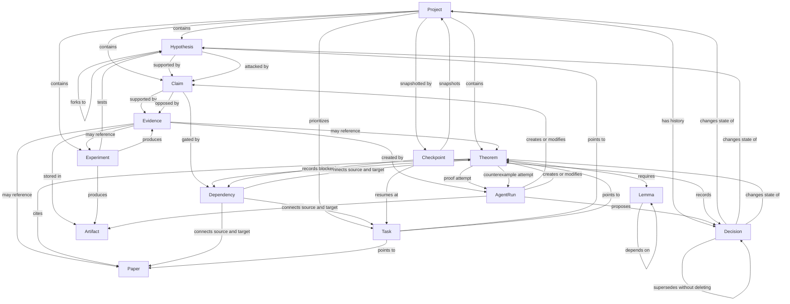

# Research State v0.1 graph

The schema represents research as linked objects. Arrows below describe
semantic relations, not storage ownership.



## Relation rules

- A Project can be FROZEN while a child Hypothesis remains RESTRICTED and an
  earlier sibling is REFUTED.
- Claim/Evidence polarity is explicit. The same Evidence can support one Claim
  and oppose another.
- Dependency is a first-class edge because “requires,” “blocks,” “contradicts,”
  and “extends” are not interchangeable.
- AgentRun provenance records authorship but does not confer verification.
- Decision `scope` prevents branch KILL from being interpreted as Project KILL.
- Checkpoint carries sufficient IDs and instructions for deterministic resume.

The CLI command below renders the live example graph:

```powershell
python -m autoresearch_state graph examples/emergent_levy_project_state.yaml
```

