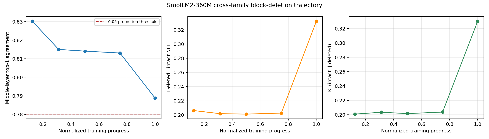
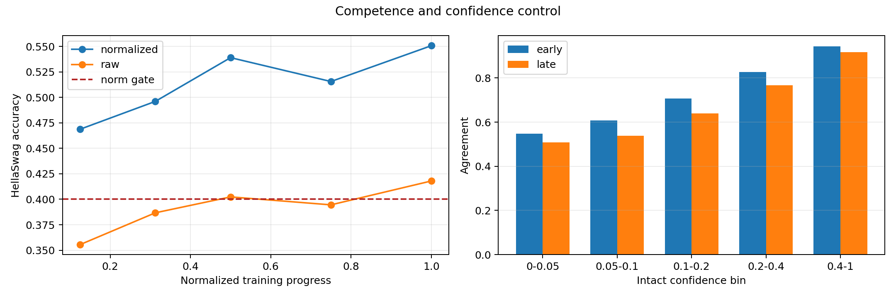

# ARC-20260825-5060-003 — Cross-Family Block-Deletion Validation

## Final verdict

**MIXED**

The preregistered direction transfers from Pythia to one competent, genuinely
non-Pythia SmolLM2-360M trajectory: late training lowers mean top-1 agreement
after bypassing one middle block, and increases both NLL damage and KL. The
direction holds in all three fixed evaluation resamples and all five confidence
bins. It nevertheless misses the preregistered primary magnitude gate
(`-0.04135`, required `<= -0.05`), and much of the change occurs only at the
final checkpoint. The public training description shows that SmolLM2-360M uses
a WSD schedule with a final 20% decay phase, so the sparse trajectory cannot
separate ordinary continued training from decay-phase effects.

This is evidence against `KILL-CROSS-FAMILY`, but it is not enough for
`PROMOTE` or a cross-family empirical law.

## Frozen question and contract

Does the Pythia result—competent later checkpoints are less functionally robust
to bypassing a middle Transformer block—survive on a different architecture,
tokenizer, training framework, and data recipe?

- Model: `HuggingFaceTB/SmolLM2-360M-intermediate-checkpoints`.
- Architecture: Llama-style decoder with GQA, 32 blocks, 361,821,120 loaded
  parameters; trained with Nanotron.
- Checkpoints: steps 320k, 800k, 1.28M, 1.92M, and 2.56M, corresponding to
  normalized progress 0.125, 0.3125, 0.5, 0.75, and 1.0.
- Primary endpoints: step320k versus step2.56M.
- Intervention: bypass exactly one block, independently, for blocks 1–30; the
  first and last blocks are excluded as in ARC-002.
- Evaluation: fixed WikiText-2 source, seeds 11/23/37, six sequences of 256
  next-token positions per seed.
- Primary metric: intact/deleted top-1 next-token agreement.
- Secondary metrics: deleted-minus-intact NLL and
  `KL(p_intact || p_deleted)`.
- Downstream gate: fixed 256-example HellaSwag validation sample, seed 20260825.
- Precision: native BF16. No simulated or fabricated measurements.

The exact revisions, thresholds, and sampling contract were frozen in
`reports/preregistered_cross_family_test.md` before cross-family deletion
inference.

## Downstream competence

All five checkpoints clear the normalized HellaSwag gate (0.40), and the final
checkpoint passes every preregistered sanity check.

| Step | Progress | Raw accuracy | Length-normalized accuracy | Normalized 95% bootstrap CI |
|---:|---:|---:|---:|---:|
| 320k | 0.125 | 0.3555 | 0.4688 | [0.4062, 0.5273] |
| 800k | 0.3125 | 0.3867 | 0.4961 | [0.4336, 0.5586] |
| 1.28M | 0.500 | 0.4023 | 0.5391 | [0.4766, 0.5977] |
| 1.92M | 0.750 | 0.3945 | 0.5156 | [0.4531, 0.5781] |
| 2.56M | 1.000 | 0.4180 | 0.5508 | [0.4883, 0.6094] |

At the final checkpoint, normalized predictions use all four labels with counts
65/56/67/68; 0 of 1,024 choices are truncated. The local normalized result
(55.08%) is close to the official model-card HellaSwag result (54.5%), providing
an external format sanity check rather than substituting for local evaluation.

## Main trajectory

| Step | Progress | Intact NLL | Agreement | NLL damage | KL |
|---:|---:|---:|---:|---:|---:|
| 320k | 0.125 | 3.2131 | 0.8302 | 0.2061 | 0.2009 |
| 800k | 0.3125 | 3.2309 | 0.8150 | 0.2017 | 0.2035 |
| 1.28M | 0.500 | 3.1673 | 0.8141 | 0.2011 | 0.2016 |
| 1.92M | 0.750 | 3.1790 | 0.8131 | 0.2026 | 0.2038 |
| 2.56M | 1.000 | 3.0583 | 0.7888 | 0.3321 | 0.3302 |

Endpoint results:

- Agreement: `0.83016 -> 0.78882`, delta `-0.04135`.
- NLL damage: `0.20615 -> 0.33207`, delta `+0.12592`.
- KL: `0.20091 -> 0.33020`, delta `+0.12929`.
- Fixed-resample agreement deltas: `-0.03199`, `-0.04794`, `-0.04412`.
- Resample bootstrap 95% CI: `[-0.04794, -0.03199]`.

The first four checkpoints mostly plateau after the initial decline. The final
interval contributes 0.02427 of the total 0.04135 agreement decline (58.7%) and
essentially all of the endpoint rise in NLL damage and KL. Thus the endpoint
direction is replicated, but a smooth training-progress account is not.

## Confidence and intact-loss controls

Every fixed confidence bin has lower agreement at the final checkpoint:

| Intact confidence | Early | Late | Delta |
|---|---:|---:|---:|
| [0.00, 0.05) | 0.5471 | 0.5076 | -0.0396 |
| [0.05, 0.10) | 0.6070 | 0.5375 | -0.0695 |
| [0.10, 0.20) | 0.7071 | 0.6391 | -0.0680 |
| [0.20, 0.40) | 0.8273 | 0.7665 | -0.0609 |
| [0.40, 1.01] | 0.9441 | 0.9174 | -0.0268 |

All bins exceed the frozen observation threshold. A descriptive five-point
regression gives a standardized-progress coefficient of `-0.00738` controlling
intact NLL and partial correlation `-0.605`. With one trajectory and only five
checkpoints, neither is inferential evidence and neither resolves the late-stage
schedule confound.

## Preregistered decision audit

| Criterion | Result |
|---|---|
| Finite native-precision harness | PASS |
| Downstream and endpoint LM competence | PASS |
| Agreement delta <= -0.05 | **FAIL** (-0.04135) |
| All three resamples negative | PASS |
| Bootstrap CI below zero | PASS |
| NLL-damage and KL deltas positive | PASS |
| Fixed confidence-bin direction | PASS |

Because one mandatory PROMOTE gate fails, the only valid verdict under the
frozen rules is **MIXED**.

## Strongest negative evidence

1. The primary endpoint decline is 17.3% smaller than the preregistered minimum
   magnitude (`0.04135` observed versus `0.05` required).
2. Agreement is nearly flat at the middle three checkpoints; strict or smooth
   monotonic erosion is not supported.
3. More than half the primary endpoint change, and effectively all secondary
   damage growth, appears in the final 25% interval.
4. SmolLM2-360M uses WSD with a final 20% decay phase. The selected 75% point is
   before that boundary and the final point is after it, so schedule phase is a
   concrete alternative explanation.
5. This is one public pretraining run, not independent SmolLM2 seeds; the
   resamples quantify evaluation variation, not training-run variation.
6. Confidence bins are coarse conditioning, and their token-layer observations
   are not independent samples.
7. The HellaSwag gate establishes intact competence only; block deletion was
   not applied to HellaSwag, so downstream deletion sensitivity remains open.
8. FP16 produced nonfinite values. The valid conclusion depends on native BF16,
   demonstrating a real harness/precision sensitivity.

## Exact supported claim

For one competent 361.8M-parameter SmolLM2 pretraining trajectory on fixed
WikiText-2 samples, the final checkpoint preserves 4.13 percentage points fewer
intact top-1 predictions under single-middle-block bypass than the 12.5%-progress
checkpoint. The direction holds across three evaluation resamples and five
intact-confidence bins and coincides with greater NLL damage and KL divergence.

## Claims not supported

- A universal cross-family law or a Pythia-sized effect.
- Smooth or monotonic erosion throughout SmolLM2 training.
- Separation of token progress from WSD decay-phase effects.
- Independent-run stability outside Pythia.
- Downstream-task robustness to block deletion.
- A mechanism, layer-specialization claim, or pruning recommendation.

## Precision incident

The first sweep cast official BF16 weights to FP16. Step1.92M intact NLL became
NaN in all three resamples, and nonfinite layer rows also appeared at two other
checkpoints. Top-1 agreement remained numerically populated because `argmax`
returns indices even for invalid logits. Those results are invalid, preserved
under `experiments/invalid_fp16/`, and excluded. The entire competence and
trajectory evaluation was rerun in native BF16 with no checkpoint, sample,
metric, layer, or threshold changed.

## Resources

- Valid trajectory checkpoint runtime: 92.62 seconds.
- Valid HellaSwag runtime: 80.95 seconds.
- Invalid FP16 diagnostic runtime retained: 789.71 seconds.
- Conservative total evaluator wall/GPU upper bound: 963.28 seconds
  (0.268 hours); active GPU time is lower.
- Peak allocated CUDA memory: 1.81 GiB on an RTX 5060 Laptop GPU (8,151 MiB).
- ARC artifact directory: 14.86 MB; model cache: 3.39 GiB.
- Frozen-selection-to-validated-aggregate wall time: 25.45 minutes.
- API/paid-service cost: USD 0.

## Recommended next ARC

**DECAY-BOUNDARY VALIDATION.** Prospectively evaluate the three already-public
late SmolLM2-360M checkpoints at 81.25%, 87.5%, and 93.75% progress, with the
same frozen evaluator, to distinguish a gradual decay-phase trajectory from a
final-checkpoint-specific jump. Predefine the model-card WSD 80% boundary as
the comparison point. Do not start mechanism work or add metrics. If the late
trajectory is not coherent, retire the cross-family law; if it is coherent,
then test one additional non-WSD family.

