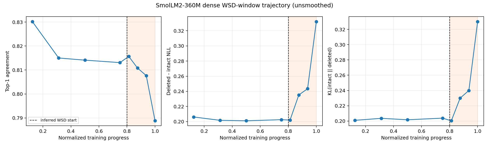
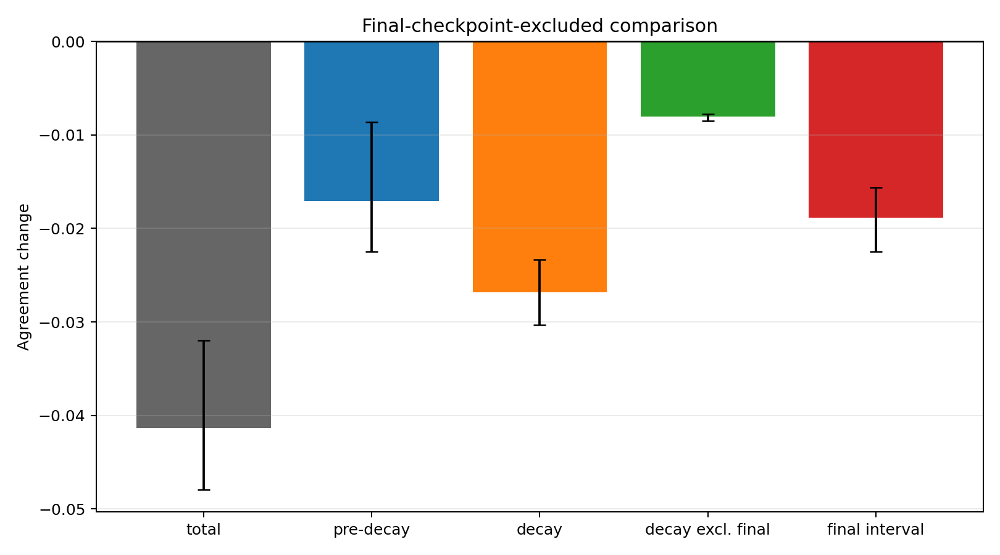
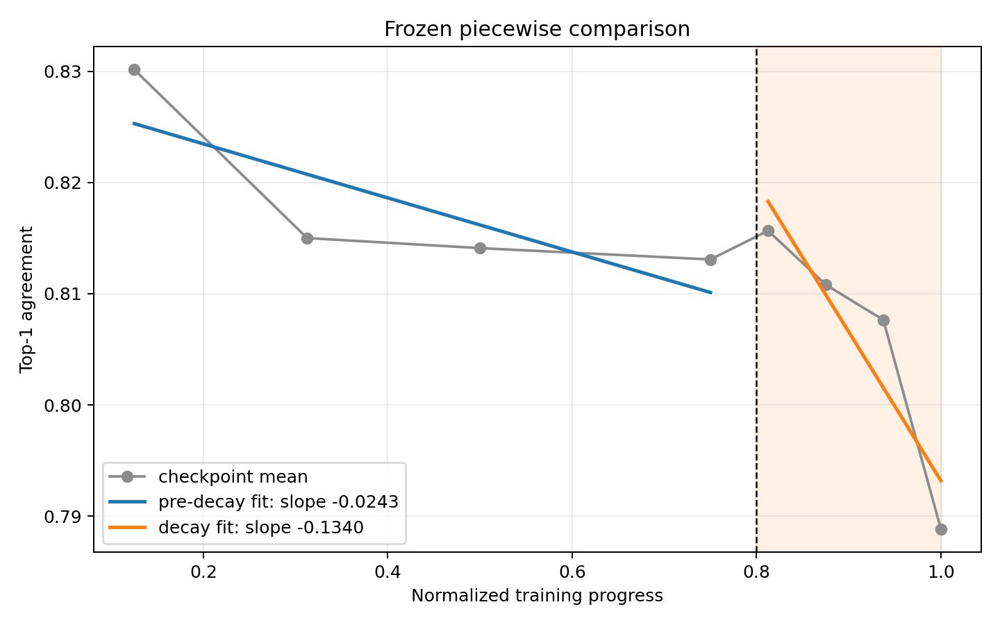

# ARC-20260825-5060-004 — SmolLM2 WSD-Window Resolution

## Final verdict

**PROMOTE-BROAD**

Under the frozen verdict contract, the SmolLM2 top-1 block-bypass degradation
is already meaningfully present before the inferred WSD decay boundary and is
not dependent on the final checkpoint. The confirmed decay window strengthens
the decline, but the result does not support strict monotonicity, a causal WSD
claim, or uniform agreement among metrics.

The exact supported claim is:

> On this SmolLM2-360M trajectory and frozen WikiText-2 block-bypass assay,
> top-1 substitutability declines significantly before the final WSD decay
> phase. A larger additional decline is observed during the decay phase, and
> remains detectable when the final checkpoint is excluded.

## Schedule reconstruction

The official checkpoint card states that one checkpoint is released every
160,000 steps and each step represents 1,572,864 tokens. The official paper
states that SmolLM2-360M was trained for 4T tokens using WSD with 20% decay.
The public trajectory's final branch is step2.56M.

Best-supported inferred boundary:

`step 2,048,000 = 3,221,225,472,000 tokens = 80% progress`.

No checkpoint exists exactly at that boundary. Step1.92M (75%) is the last
public pre-decay point and step2.08M (81.25%) is the first public decay point.
Their interval is boundary-straddling and is never assigned wholly to a phase.

## Frozen evaluation

- Model: `HuggingFaceTB/SmolLM2-360M-intermediate-checkpoints`, native BF16,
  361,821,120 parameters, 32 Llama/GQA blocks.
- Eight trajectory points: 12.5%, 31.25%, 50%, 75%, 81.25%, 87.5%, 93.75%,
  and 100%.
- Newly evaluated: 81.25%, 87.5%, and 93.75%; all other raw records were
  reused exactly from ARC-003.
- Intervention: independently bypass blocks 1–30.
- Per checkpoint: three fixed resamples, 4,608 token positions, and 138,240
  token-layer observations.
- Uncertainty: paired three-resample deltas and a frozen 10,000-draw
  seed-level bootstrap. These are evaluation resamples, not independent
  pretraining runs.
- Competence: unchanged 256-example HellaSwag sample plus intact WikiText NLL.

## Full trajectory

| Step | Progress | Phase | Intact NLL | Agreement | NLL damage | KL | HellaSwag norm. |
|---:|---:|---|---:|---:|---:|---:|---:|
| 320k | 12.50% | pre-decay | 3.2131 | 0.8302 | 0.2061 | 0.2009 | 0.4688 |
| 800k | 31.25% | pre-decay | 3.2309 | 0.8150 | 0.2017 | 0.2035 | 0.4961 |
| 1.28M | 50.00% | pre-decay | 3.1673 | 0.8141 | 0.2011 | 0.2016 | 0.5391 |
| 1.92M | 75.00% | pre-decay | 3.1790 | 0.8131 | 0.2026 | 0.2038 | 0.5156 |
| 2.08M | 81.25% | WSD decay | 3.1435 | 0.8157 | 0.2021 | 0.2003 | 0.5156 |
| 2.24M | 87.50% | WSD decay | 3.1279 | 0.8108 | 0.2352 | 0.2300 | 0.5313 |
| 2.40M | 93.75% | WSD decay | 3.1043 | 0.8076 | 0.2434 | 0.2400 | 0.5586 |
| 2.56M | 100.00% | WSD decay | 3.0583 | 0.7888 | 0.3321 | 0.3302 | 0.5508 |

## Effect partition

| Partition | Agreement change | Three resample deltas | Bootstrap 95% CI |
|---|---:|---|---|
| Total, 12.5%→100% | -0.04135 | -0.03199, -0.04794, -0.04412 | [-0.04794, -0.03199] |
| Pre-decay, 12.5%→75% | **-0.01708** | -0.00866, -0.02250, -0.02007 | **[-0.02250, -0.00866]** |
| Boundary-straddling, 75%→81.25% | +0.00258 | +0.00699, -0.00208, +0.00284 | [-0.00208, +0.00699] |
| Confirmed decay, 81.25%→100% | **-0.02685** | -0.03032, -0.02335, -0.02689 | **[-0.03032, -0.02335]** |
| Decay excluding final, 81.25%→93.75% | **-0.00802** | -0.00786, -0.00775, -0.00846 | **[-0.00846, -0.00775]** |
| Total excluding final, 12.5%→93.75% | **-0.02252** | -0.00953, -0.03234, -0.02569 | **[-0.03234, -0.00953]** |
| Final interval, 93.75%→100% | **-0.01883** | -0.02246, -0.01560, -0.01842 | **[-0.02246, -0.01560]** |

- Pre-decay contributes 41.3% of the total endpoint decline.
- Confirmed decay contributes 64.9%. These sum above 100% because the
  boundary-straddling interval briefly moves in the opposite direction.
- The broader 75%→100% interval contributes 58.7% of the total.
- The final interval is the largest single interval. It contributes 77.6% of
  the 75%→100% decline, but it is not the sole source: the confirmed-decay
  decline excluding final remains negative in all three resamples.

## Piecewise comparison

- Pre-decay agreement slope: `-0.02432` per unit normalized progress; three
  seed slopes all negative; bootstrap 95% CI `[-0.03529, -0.01045]`.
- Confirmed-decay slope: `-0.13397`; three seed slopes all negative;
  bootstrap 95% CI `[-0.14344, -0.12576]`.

The decay slope is substantially steeper, but comparing two observational
training phases does not identify WSD as the cause.

## NLL damage and KL

The secondary metrics sharply narrow the interpretation.

| Metric | Pre-decay change | Confirmed-decay change | Decay excluding final |
|---|---:|---:|---:|
| NLL damage | -0.00359, CI [-0.01089, +0.00228] | **+0.13000**, CI [+0.12077, +0.14688] | **+0.04137**, CI [+0.02019, +0.05462] |
| KL | +0.00285, CI [-0.01011, +0.01233] | **+0.12991**, CI [+0.11451, +0.13954] | **+0.03968**, CI [+0.02985, +0.05153] |

Thus pre-decay top-1 agreement degradation is not accompanied by robust
pre-decay growth in NLL damage or KL. Functional damage growth is concentrated
in the confirmed decay phase and survives exclusion of the final checkpoint.
This metric discordance forbids a stronger statement that all forms of block
robustness broadly erode before decay.

## Competence and confidence controls

- All eight checkpoints pass both competence gates.
- HellaSwag normalized accuracy ranges 0.4688–0.5586; the final model remains
  competent at 0.5508.
- Intact WikiText NLL ranges 3.0583–3.2309 and improves through the decay
  checkpoints; degradation is not caused by model competence collapse.
- Pre-decay comparison: all 5/5 fixed confidence bins decline.
- Confirmed decay: 4/5 bins decline; the lowest-confidence bin changes +0.0057.
- Total excluding final: all 5/5 bins decline.
- Across all eight checkpoints, the descriptive progress coefficient
  controlling intact NLL is only `-0.00213`, with partial correlation `-0.166`.
  This weak adjusted association is negative evidence against treating raw
  training progress as a complete explanation.

## Negative evidence first

1. Pre-decay NLL damage is flat/mixed and pre-decay KL is mixed; only the
   top-1 statistic supplies robust pre-decay evidence.
2. Adjacent behavior is not smooth. The 31.25%→50%, 50%→75%, 75%→81.25%,
   81.25%→87.5%, and 87.5%→93.75% intervals have mixed resample signs or CIs
   including zero.
3. The 75%→81.25% boundary-straddling mean moves upward by 0.00258.
4. The final interval is unusually large and accounts for 77.6% of the
   boundary-bracketing decline.
5. The NLL-adjusted eight-point progress association is weak.
6. The exact 80% checkpoint is unavailable; change within 75%→81.25% cannot be
   assigned cleanly to either phase.
7. This remains one SmolLM2 pretraining run. Bootstrap intervals quantify
   evaluation resampling, not independent-run uncertainty.
8. Confidence bins are coarse and token-layer observations are dependent.

## Frozen verdict audit

`PROMOTE-BROAD` required a pre-decay delta <=-0.01, at least 25% of total,
3/3 negative resamples with CI below zero, a negative pre-decay slope with CI
below zero, and a robust negative total after excluding the final checkpoint.
Every condition passes. The verdict does not require or imply strict adjacent
monotonicity.

## Supported and unsupported claims

Supported:

- The primary top-1 block-bypass decline precedes the inferred WSD boundary.
- A steeper additional primary decline and functional NLL/KL damage appear
  during the observed decay checkpoints.
- Neither the total primary decline nor the confirmed-decay decline collapses
  when the final checkpoint is removed.

Not supported:

- WSD causally creates or amplifies the effect.
- Smooth checkpoint-by-checkpoint degradation.
- Broad pre-decay degradation in NLL damage or KL.
- A universal cross-family, scaling, optimizer, or mechanism law.
- Downstream-task degradation under block bypass.

## Resources

- New checkpoint inference runtime: 379.05 seconds, including downloads.
- New HellaSwag runtime: 45.23 seconds.
- Conservative new evaluator GPU/wall upper bound: 424.28 seconds
  (0.118 GPU-hours); active GPU time is lower.
- Peak allocated CUDA memory: 1,947,464,192 bytes (1.814 GiB).
- Model-cache increase: 2,181,156,573 bytes (2.031 GiB).
- ARC artifact increase through aggregation: 1,851,850 bytes (1.77 MiB).
- C: free-space decrease: 2,187,227,136 bytes (2.037 GiB).
- Preregistration/resource snapshot to validated aggregate: 16.09 minutes.
- API/paid-service cost: USD 0.

## Recommended next ARC

**DOWNSTREAM-DELETION VALIDATION.** Without adding a model or mechanism claim,
prospectively test whether the same early/pre-decay/prefinal/final ordering is
visible when block bypass is scored on the already-validated HellaSwag task.
Use a compute-bounded checkpoint/layer subset frozen before results. If
downstream deletion sensitivity does not track the LM assay, narrow the project
to a next-token substitutability phenomenon rather than a general robustness
claim.

